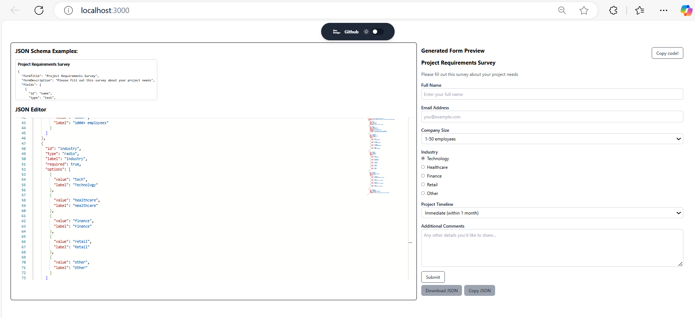
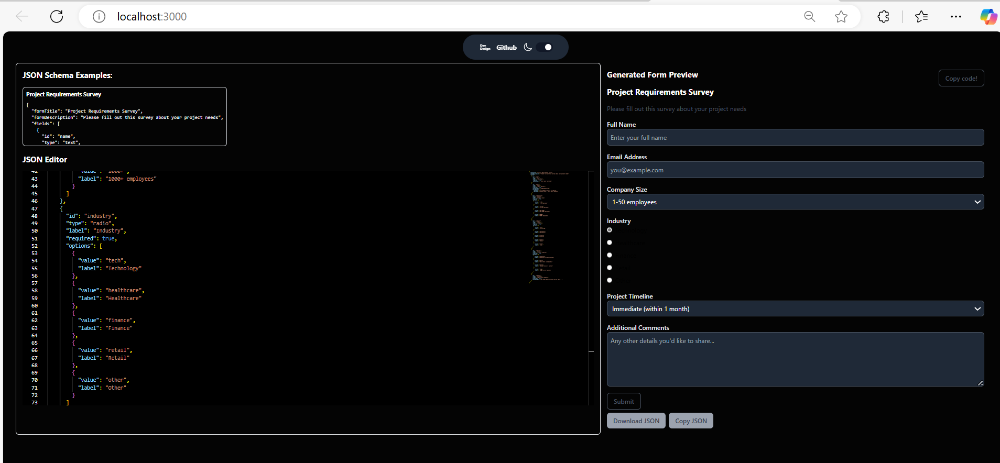

# 📝 Dynamic Form Generator


*A Dynamic Form Generator is a robust React-based project that allows users to generate dynamic forms based on predefined schemas. Real-time previews, customizable validation, and a clean UI make form creation seamless and efficient. Perfect for developers and businesses who need dynamic form rendering on the fly!*

## ✨ Features
1️⃣ **Dynamic Form Rendering**: Generate forms based on schema definitions.

2️⃣ **Real-Time Preview:** Instant updates as you define your form.

3️⃣ **Schema Validation:** Add validation rules for text, email, and numbers.

4️⃣ **Dark Mode Support:** Beautifully designed for light and dark themes.

5️⃣ **Copy Code & Export JSON:** Easily copy generated code or export form data in JSON format.

## 🛠️ Tech Stack
1️⃣ **Frontend:** React, TypeScript, Tailwind CSS

2️⃣ **Framework**: Next.js

3️⃣ **State Management:** React Hook Form

4️⃣ **Context Management:** Custom Theme Context using **createContext()** and **useContetxt()**

5️⃣ **Testing:** Playwright and Jest for Testing 

## 📦 Dependencies
1️⃣ **react-hook-form**: Easy form state management and validation

2️⃣ **tailwindcss:** Utility-first CSS framework for rapid UI development

3️⃣ **typescript:** Static type checking for maintainable code

## 🚀 Installation
_Follow these steps to get the Dynamic Form Generator up and running on your local machine:_

1️⃣ Clone the Repository
```bash
  git clone https://github.com/your-username/sample.git
```  
2️⃣ Navigate to the Project Directory
```bash
  cd sample
``` 
3️⃣ Install Dependencies
```bash
  npm install
```  
4️⃣ Start the Development Server
```bash
  npm run dev
```  
5️⃣🚀 Open http://localhost:3000 in your browser to view the project.**

## 🛠️ Usage
-Define your schema in the application.
-Preview the dynamically rendered form in real-time.
-Copy the generated form code or export form data as JSON for seamless integration into your workflow!

## Images





